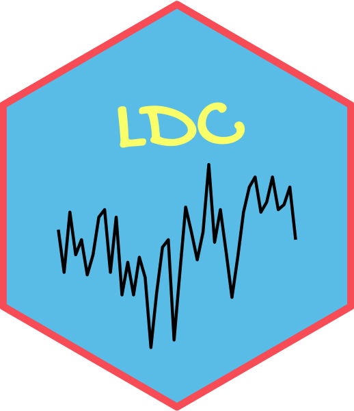
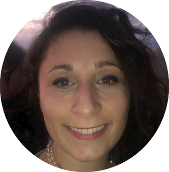
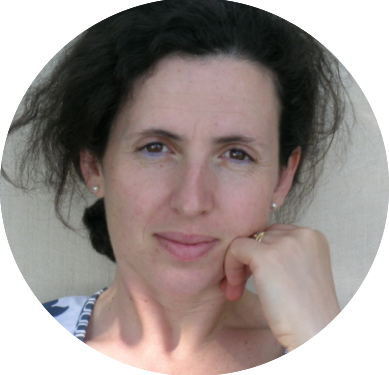
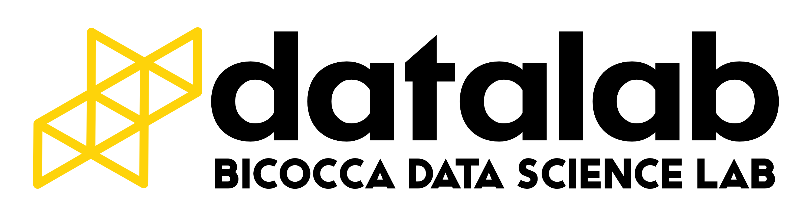

```{r setup, include=FALSE}
options(htmltools.dir.version = FALSE)
```


class: center

# I edizione del Lab Data Challenges



---
background-size: 100%
background-image: url(https://media.giphy.com/media/H7ODVHu0kTVnfenNtk/giphy.gif)

---

# Electricity Load Forecast Challenge

### In collaborazione con


.pull-left[


**Fabio Baldi**

Head of Market Risk & Business Analytics

]

.pull-right[



**Carmelina Tipoldi**

Models and Analysis 

]


---

# Bicocca - organizzatori

.pull-left[


**Vittoria Cerasi**

Coordinatrice del CLAMSES

Professore di Economia

]

.pull-right[


**Matteo Pelagatti**

Direttore del DEMS

Professore di Statistica Economica 

]

---

# Bicocca - docenti

.pull-left[


**Aldo Solari**

Professore di Statistica

]

.pull-right[


**Andrea Gilardi**

Ricercatore di Statistica

]

---

### Con il supporto di 


.pull-left[



]

.pull-right[


**Giovanni Pelosi**

Datalab Cloud Engineer

]

---

# Studenti


## BOYS

* Angelo Camera 

* Nicola Crespi

* Simone Frigerio 

* Nicholas Moro 

## GIRLS

* Margherita Parmi 

* Laura Accorto 

* Valentina Zangirolami

---

# Agenda 


* **6 Maggio 2021** : **INTRODUZIONE AL PROBLEMA (REPOWER)**

* 10 Maggio 2021 : LAB I

* 13 Maggio 2021 : LAB II 

* 17 Maggio 2021 : LAB III  

* 20 Maggio 2021 : LAB IV  

* 24 Maggio 2021 : LAB V  

* 28 Maggio 2021 (in presenza) : PRESENTAZIONE FINALE (STUDENTI)
