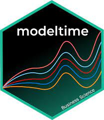

# Workflow

 .footnote[Immagine tratta dal libro [R for Data Science](https://r4ds.had.co.nz/) di Hadley Wickham e Garrett Grolemund]

---

# Labs

| Laboratorio | Attività |
|----------|----------|
| I | Import, Tidy, Understand (Explore)|
|||
| II | Understand (Explore) |
|||
| III | Understand (Modeling) |
|||
| IV | Understand (Modeling) |
|||
| V | Communicate |

---

# Tasks

---

# Assignments

---

layout: false
class: inverse, middle, center

# Workflow

---

# Import

[data.table](https://rdatatable.gitlab.io/data.table/)

Ulteriori riferimenti:

[A gentle introduction to data.table]( https://atrebas.github.io/post/2020-06-17-datatable-introduction/) by Atrebas

---

# Tidy, transform and visualize

[tidyverse](https://www.tidyverse.org/)

---

# Modelling process

.footnote[Immagine tratta dal libro [Feature Engineering and Selection](http://www.feat.engineering/index.html) di Max Kuhn e Kjell Johnson]
 
---

# Modelling

[tidymodels](https://www.tidymodels.org/)

Ulteriori riferimenti:

[Tidy Modeling with R](https://www.tmwr.org/) by Max Kuhn and Julia Silge

---

# Modelling time series

[fable](http://fable.tidyverts.org/index.html)

Ulteriori riferimenti:

[Forecasting: Principles and Practice (3rd ed)](https://otexts.com/fpp3/) by Rob J. Hyndman and George Athanasopoulos

---

# Modelling time series

[modeltime](https://business-science.github.io/modeltime/)

