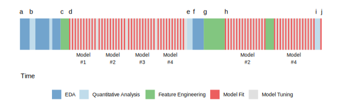

```{r, echo=FALSE}
library(fontawesome)
```

# WORKFLOW


.footnote[Immagine tratta dal libro [R for Data Science](https://r4ds.had.co.nz/) di Hadley Wickham e Garrett Grolemund]

---

# `r fa("flask")` LABS


```{r, echo = FALSE}
tab = data.frame(
Lab = c("I","II","III","IV","V"),
Activity = c("Import, Tidy, Understand (Explore)",
             "Understand (Explore)",
             "Understand (Modeling)",
             "Understand (Modeling)",
             "Communicate")
)
library(kableExtra)
tab %>% 
  kable(booktabs = T) %>%
  kable_styling() %>%
  row_spec(0:5,color = "black", background = "white")
```


---

# LAB STRUCTURE


## `r fa("slideshare")` presentazioni (studenti)

## `r fa("tasks")` assegnazione del task (docenti)

## `r fa("terminal")` lavoro di gruppo (studenti)

## `r fa("file-code")` soluzione del task (docenti)

## `r fa("edit")` homework 

---

# `r fa("edit")` HOMEWORK ZERO

## Presentazione del problema e strategia di analisi

Descrizione del problema

Strategia di analisi

  * Punti di forza
  
  * Punti di debolezza

---

# Il dataset

Il dataset è costituito da $22495$ serie storiche di consumo orario di elettricità, ciascuna delle quali si riferisce ad un determinato punto di consegna (*point of delivery*, `POD`). 

Sono state misurate le seguenti variabili:

* `POD` id unità statistica (`integer`)

* `DataMisura` data della misurazione `YYYY-MM-DD` (`IDate`)

* `OraMisura` ora della misurazione 0,1,...,23 (`integer`)

* `Consumo` Consumo kWh (`numeric`) 

* `Zona` Zona di mercato: `Z1`, ..., `Z7` (`character`) 

* `Temp` Temperatura della Zona in °C (`numeric`) 

* `Wind` Ventosità della Zona (`numeric`) 

* `Glob_radiation` Radiazione globale della Zona (`integer`) 

Le misurazioni coprono l'arco temporale  1 Maggio 2018 - 15 Novembre 2020. 

---

# Long format

* 8 colonne (variabili)

* 306762394 righe (osservazioni)

```{r, eval=FALSE}
            POD DataMisura OraMisura Consumo Zona Temp Wind Glob_radiation
        1:    1 2019-03-01         0   8.400   Z1  9.0  3.5             NA
        2:    1 2019-03-01         1   8.400   Z1  8.0  3.2             NA
        3:    1 2019-03-01         2   8.200   Z1  7.0  2.8             NA
        4:    1 2019-03-01         3   7.400   Z1  6.0  2.5             NA
        5:    1 2019-03-01         4   6.600   Z1  5.0  2.1             NA
       ---                                                                
306762390: 9998 2020-10-31        19   0.674   Z2 10.5  1.3              0
306762391: 9998 2020-10-31        20   0.675   Z2 10.5  1.0              0
306762392: 9998 2020-10-31        21   0.674   Z2 10.0  1.0              0
306762393: 9998 2020-10-31        22   0.674   Z2  9.5  1.0              0
306762394: 9998 2020-10-31        23   0.428   Z2 11.0  1.3              0
```


---

# Obiettivo dell'analisi 

* Training set: 1 Maggio 2018 - 15 Novembre 2020

* Test set: 16 Novembre 2020 - 3 Dicembre 2020

* Obiettivo: prevedere il consumo orario aggregato per Zona nei giorni 1, 2 e 3 Dicembre 2020

* Criterio di valutazione: Median Absolute Error

$$\mathrm{MAE} = \sum_{z\in \{Z1,\ldots,Z7\}} \sum_{d=1}^{3} \sum_{h=0}^{23} |y_{z,d,h} - \hat{y}_{z,d,h}|$$
---

# Riferimenti 

* Corinne Walz, Franziska Ziemer (2009) [Electrical Load Forecasting in R](https://www.r-project.org/conferences/useR-2009/slides/Walz+Ziemer+Amberti.pdf). *The R User Conference
Rennes, France*.


* Rainer Göba, Kristina Lurza and Antonio Pievatolo (2013) Electrical load forecasting by exponential
smoothing with covariates. *Applied Stochastic Models in Business and Industry* **29**, 629--645

* `timetk::taylor_30_min` : R dataset (4032 $\times$ 2) on half-hourly electricity demand in England and Wales from Monday 5 June 2000 to Sunday 27 August 2000. Discussed in Taylor JW (2003) Short-term electricity demand forecasting using double seasonal exponential smoothing. *Journal of the Operational Research Society* **54**, 799-805

---

### Serie storica oraria aggregata per Zona


---

### Distribuzione oraria


---

### Serie storica giornaliera


---

### Previsione giornaliera


---

# `r fa("tasks")` ESEMPIO DI TASK

1. Importare i dati con il comando `fread()` della libreria `data.table`. Verificare la codifica (`class`) delle variabili. Ordinare i dati secondo `POD`, `DataMisura` e `OraMisura`.  

2. Presenza di `NA` nelle variabili `DataMisura`, `OraMisura` e `Zona`?

3. Qual è il numero di `POD` presente nel dataset? Quanti `POD` per ogni `Zona` ? Ogni `POD` corrisponde ad una e una sola `Zona` ?

4. Qual è la data della prima misurazione? E dell'ultima? 

5. Ci sono `POD` che "escono" e poi "rientrano" nel dataset? Cioè, ci sono `POD` con osservazioni non consecutive? Rappresentare il risultato graficamente per alcuni `POD`. 

6. Rappresentare graficamente la distribuzione di frequenza della prima data di misurazione dei `POD`. Fare lo stesso per l'ultima data di misurazione. 

7. E' sempre vero che i `POD` entrano alle ore "00"? Quanti/quali sono i `POD` che entrano ad un orario diverso delle 00?

---

# `r fa("file-code")` ESEMPIO DI SOLUZIONE

```{r, eval=FALSE}
library(data.table)

repower <- fread(
  input = "repower.txt"
)

repower

##              POD DataMisura OraMisura Consumo Zona Temp Wind Glob_radiation
##         1:     1 2019-03-01         0    8.40   Z1  9.0  3.5             NA
##         2:     1 2019-03-01         1    8.40   Z1  8.0  3.2             NA
##         3:     1 2019-03-01         2    8.20   Z1  7.0  2.8             NA
##         4:     1 2019-03-01         3    7.40   Z1  6.0  2.5             NA
##         5:     1 2019-03-01         4    6.60   Z1  5.0  2.1             NA
##        ---                                                                 
## 329420859: 23436 2020-03-31        19   39.06   Z1 10.0  3.6              3
## 329420860: 23436 2020-03-31        20   39.96   Z1  9.0  5.1              0
## 329420861: 23436 2020-03-31        21   40.50   Z1  8.0  3.6              0
## 329420862: 23436 2020-03-31        22   41.40   Z1  7.4  3.3              0
## 329420863: 23436 2020-03-31        23   41.58   Z1  6.8  3.1              0
```

---

## `r fa("terminal")` lavoro di gruppo 

* Durante gli incontri utilizzeremo le risorse cloud (Microsoft Azure) messe a disposizione dal datalab

* Le macchine virtuali v61 e v62 saranno disponibili per tutta la durata dell'attività

* Risulterà utile utilizzare GitLab `r fa("gitlab")` per il controllo versione (*version control*) 

---

layout: false
class: inverse, middle, center

# Librerie R

---

# Import

[data.table](https://rdatatable.gitlab.io/data.table/)


Ulteriori riferimenti:

[A gentle introduction to data.table]( https://atrebas.github.io/post/2020-06-17-datatable-introduction/) by Atrebas

---

# Tidy, transform and visualize

[tidyverse](https://www.tidyverse.org/)


---

# Modelling process



.footnote[Immagine tratta dal libro [Feature Engineering and Selection](http://www.feat.engineering/index.html) di Max Kuhn e Kjell Johnson]
 
---

# Modelling

[tidymodels](https://www.tidymodels.org/)


Ulteriori riferimenti:

[Tidy Modeling with R](https://www.tmwr.org/) by Max Kuhn and Julia Silge


---

# Modelling time series

[fable](http://fable.tidyverts.org/index.html)


Ulteriori riferimenti:

[Forecasting: Principles and Practice (3rd ed)](https://otexts.com/fpp3/) by Rob J. Hyndman and George Athanasopoulos

---

# Modelling time series

[modeltime](https://business-science.github.io/modeltime/)


