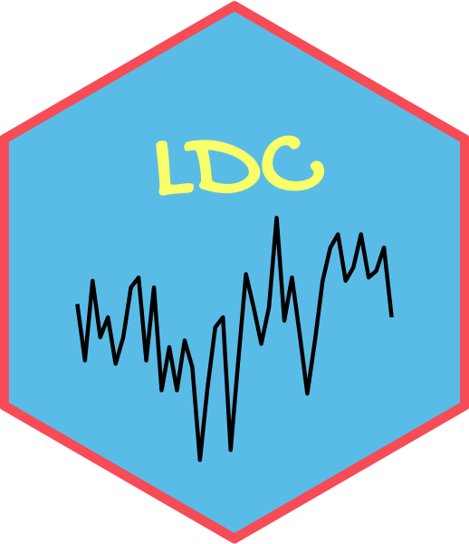

```{r setup, include=FALSE}
knitr::opts_chunk$set(echo = TRUE)
```


*Corso di Laurea Magistrale in Scienze Statistiche ed Economiche, Università degli Studi di Milano-Bicocca*


{width=10%}

A partire dall’A.A. 2020-21 è stato istituito all’interno del percorso della Laurea magistrale in Scienze Statistiche ed Economiche un laboratorio denominato "Lab Data Challenges" (LDC) a cui vengono attribuiti 2 CFU di "Altre attività formative".
LDC consiste in un laboratorio di 24 ore per un gruppo particolarmente motivato di studenti a cui si affida l’analisi di un dataset. Gli studenti si metteranno alla prova con le proprie competenze tecniche (programmazione, capacità di dominare e applicare le metodologie statistiche ad un problema reale) e professionali (lavoro di gruppo, elaborazione di un progetto di analisi dei dati, problem solving, valutazione critica e ragionata dei risultati ottenuti; comunicazione e public speaking).

La challenge di quest'anno

## [Electricity Load Forecast Challenge](docs/INTRO/INTRO.html)

in collaborazione con

{width=20%}

Repower è una società attiva su tutta la filiera energetica (produzione, distribuzione e commercializzazione). Una delle attività più importanti al fine di ottimizzare il costo di approvvigionamento dell’energia è la previsione dei consumi futuri dei propri clienti. Il progetto proposto consiste nello sviluppare un modello di previsione con un orizzonte di 72 ore del consumo dei clienti utilizzando i dati sui consumi storici degli ultimi due anni e le informazioni relative alla temperatura.
Il mercato elettrico italiano è suddiviso in 7 zone di mercato ed è necessario produrre un forecast separato per ogni zona in cui Repower ha dei clienti.
Il dataset consiste nello storico degli ultimi due anni dei consumi orari di tutti i clienti (circa 23000 clienti) e delle relative temperature. Il dataset è un’unica tabella con circa 330 milioni di osservazioni. Il progetto fornirà quindi un'occasione per avvicinarsi all'analisi dei big data. 

## I laboratori

* 6 Maggio 2021: **Introduzione ai [LABS](docs/LABS/LABS.html)**

* 10 Maggio 2021: **[LAB I](docs/LAB1/LAB1.html)** 
   
* 13 Maggio 2021: **[LAB II](docs/LAB2/LAB2.html)** 
   
* 17 Maggio 2021: **[LAB III](docs/LAB3/LAB3.html)** 
   
* 20 Maggio 2021: **[LAB IV](docs/LAB4/LAB4.html)**
   
* 24 Maggio 2021: **LAB V** 


